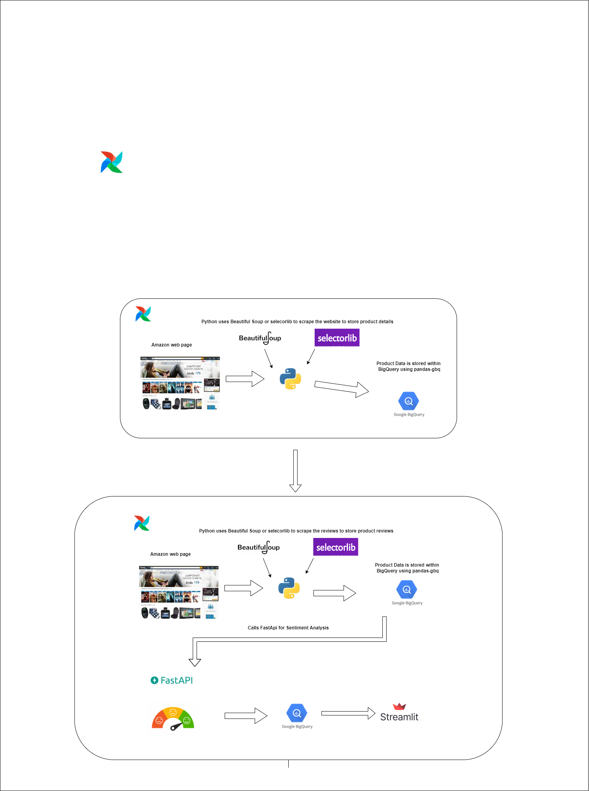
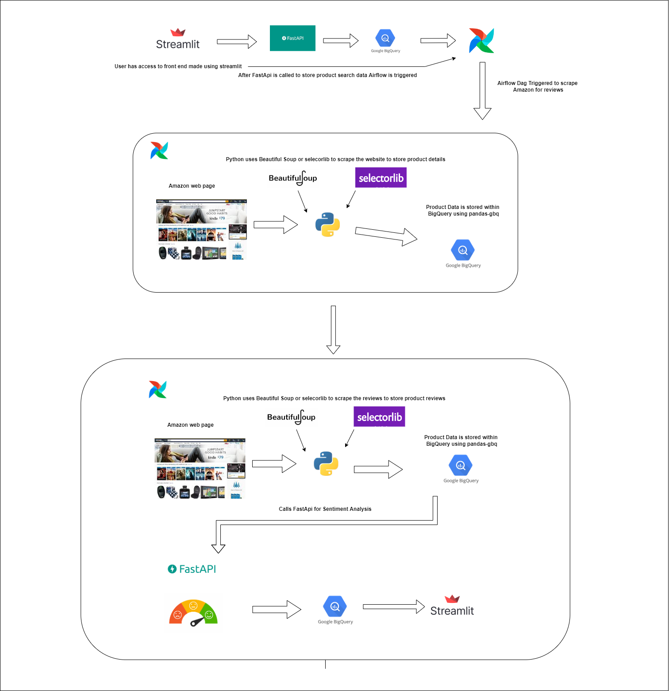

# product-recommendation-using-review-sentiment-analysis 

## Description 
Recommends products to the user on the basis of review sentiment analysis

## Links used for the project
* Codelab Doc - [link](https://docs.google.com/document/d/1GfmdoByty7ZWO9nkfJnps5On1DQxQDlSLDi5CvqImD8/edit?usp=sharing)
* PPT - [link](https://docs.google.com/document/d/1GfmdoByty7ZWO9nkfJnps5On1DQxQDlSLDi5CvqImD8/edit?usp=sharing)
* Airflow - [link](http://35.196.111.228:8080/home)
* FastAPI Doc - [link](http://34.73.35.12:8090/docs)
* Streamlit Frontend - [link](https://damg7245-finalproject-sentiment-analysis-fol52rb4xq-ue.a.run.app)

## Architecture 
### For bestsellers scraping

### For rest of the Apis

---

## Branch Descriptions
* Airflow-Dags-and-Script Branch \
Contain all the function scripts in airflow dag : \
AmazonBestSeller.csv \
Bestsellerdag.py \
ScrapingAmazonReviews.py \
append_product_search_review_ratings.py \
Update append_product_search_review_ratings.py \
asin_from_url.py \
asinscraperdag.py \
bestsellerratingsupdate.py \
key.json \
logfunc.py \
product_name_scrape.py \
Update product_name_scrape.py \
product_rating_final.py \
Update product_rating_final.py \
productsearch.py \
read_scraped.py \
review_scraper.py \
scraperforasin.py \
Update scraperforasin.py \
scraperforurl.py \
Update scraperforurl.py \
selectors.yml \
urlscraperdag.py 

* Model Train \
Contains CNN model and pickle file for sentiment review rating: \
amazon_reviewscnn.hdf5 \
training_model.py 

* api-for-prediction branch \
Contains fast api for review prediction: \
Dockerfile \
README.md \
amazon_reviewscnn.hdf5 \
key.json \
main.py \
requirements.txt 

* for streamlit \
Contains our streamlit application: \
Dockerfile \
Home_Page.py \
architecture.png \
config.yaml \
design_diagram.png \
hashed_password.py \
image.png \
key.json \
requirements.txt \
test.py 

* Pytest \
Unit test for all the functions we used: \
test_get_asin.py \
test_get_asin_1.py \
test_product_rating.py \
test_read_scrape.py \
test_review_scraper.py \
test_scraping_amazon_reviews.py 

## Endnotes

WE ATTEST THAT WE HAVEN’T USED ANY OTHER STUDENTS' WORK IN OUR ASSIGNMENT AND ABIDE BY THE POLICIES LISTED IN THE STUDENT HANDBOOK

**Contribution**: 🤝
*   Abhijit Kunjiraman: `50%`
*   Adina : `50%`

---
